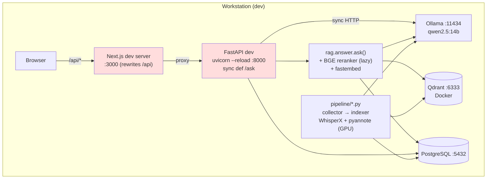
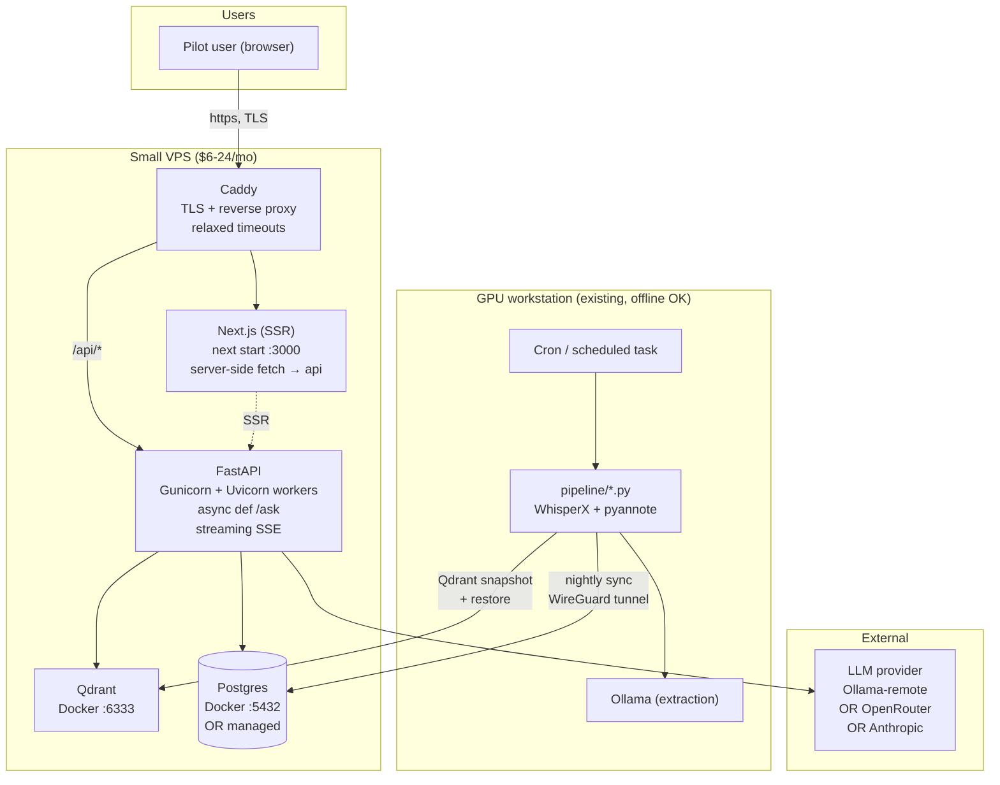

# Neo v2 — Architecture Review

> Author: architecture-designer skill · Date: 2026-08-04 · Mode: read-only assessment.
> Scope: verify the reverse spec (`specs/neo_v2_reverse_spec.md`) against source and produce an actionable path to a simple, reliable, provider-portable production deployment for ~5 pilot users.

---

## 1. Executive summary

Neo v2 is well-modularised for a workstation-run project: FastAPI + Next.js + Postgres + Qdrant + Ollama, with a clear pipeline/query split, single-source-of-truth state machine, and a citation-obsessed RAG design. It is *not* production-ready as-is for external pilots — but the fixes are shallow, mostly ops-side, and do not require re-architecting.

**Blockers for the pilot goal (in priority order):**

1. **`/ask` is a synchronous, unbounded, unauth'd endpoint** that can run 30–90 s and holds a request thread the whole time. This is the direct cause of the observed `ECONNRESET` / socket-hang-up. Not a bug in one place — a design gap across FastAPI (sync def), Next.js rewrite (60 s default idle), and Ollama (no HTTP timeout).
2. **No auth story.** Zero middleware, no header check, no per-user log context. Publishing this to the internet exposes the DB via `/export/*.csv` and lets anyone burn Ollama tokens.
3. **GPU coupling.** `pipeline/asr_processor.py` requires WhisperX + CUDA at import time. Ingestion and serving must NOT share a process/machine in production — they already don't functionally, but the codebase invites the mistake.
4. **The dev-mode server is what runs today.** `uvicorn --reload`, one worker, no proxy, no TLS.

The rest — refactor debt, JSONL-vs-`query_logs`, README/code drift on Claude — is not blocking.

**Recommended deployment (2 machines, ~$25–60/mo):**

- One small always-on VPS (Hetzner CX22 / DigitalOcean Basic / Fly.io machine) running: Caddy → FastAPI (Gunicorn+Uvicorn) → Postgres → Qdrant. All in Docker Compose.
- One GPU workstation (your existing one) running the ingestion pipeline on a schedule, pushing to the VPS's Postgres + Qdrant over WireGuard or via periodic dump/restore.
- Managed Postgres optional (Supabase / Neon) if you'd rather not run it.

This preserves provider portability (everything is stock Docker + open-source), avoids K8s, and scales to a couple dozen users before needing more thought.

---

## 2. Verification of the reverse spec

I re-verified every non-trivial claim from `neo_v2_reverse_spec.md` against source. Findings:

| Claim | Status | Note |
|---|---|---|
| FastAPI factory in `api/main.py:create_app` with 7 routers | ✔ verified | `main.py:17-77` |
| `/ask` is `POST` and calls `rag.answer.ask` synchronously | ✔ verified — and worse than the spec implies | `ask.py:10-12` uses `def`, not `async def`. Under FastAPI, sync endpoints run in a threadpool (default 40), so many concurrent `/ask` calls can starve the pool. |
| Generator hardcodes Ollama, ignores `ANTHROPIC_API_KEY` | ✔ verified | `rag/generator.py` never imports `anthropic`; grep of the repo for `anthropic\|CLAUDE_MODEL` returns hits only in `config.py`, `pyproject.toml`, `uv.lock`, `.env.example`, and a test-fixture VTT. README section is stale. |
| CORS restricted to `localhost:3000/3001` and `127.0.0.1:3000` | ✔ verified | `api/main.py:33-40`. **Blocker for any hostname other than these.** |
| Streaming supported in generator but not exposed by `/ask` | ✔ verified | `rag/answer.py:346-354` returns a generator when `stream=True`; `api/routers/ask.py` never sets it. Fix is trivial (`StreamingResponse` or SSE). |
| Retriever loads BGE reranker + fastembed lazily as module singletons | ✔ verified | `rag/retriever.py:57-93`. First `/ask` in a fresh process pays ~5–15 s of model-load cost. |
| Pipeline state machine consolidated in `pipeline/states.py` | ✔ verified | `pipeline/states.py` is imported by extractor, quality_gate, indexer, data_packager, initiative_extractor. |
| Adapter Protocol + registry | ✔ verified | `pipeline/sources/__init__.py:24-50`, `pipeline/sources/base.py:68-78`. |
| DB session pooling defaults | ✔ verified as concerning | `api/db/session.py:12` uses `create_engine(URL, pool_pre_ping=True)` — no explicit `pool_size` / `max_overflow`. Default is 5+10. Combined with sync `/ask` blocking, contention is likely. |
| No auth middleware | ✔ verified | No `Depends(security_scheme)`, no header check anywhere in `api/`. |
| Uvicorn dev startup | ✔ verified | `api/main.py:79-81` runs `uvicorn.run(..., reload=True)` when `__main__`; README uses same in serving. Single process, single worker, hot-reload on. |
| `query_logs` DB table unused in write path | ✔ verified | No `.add(QueryLog(...))` or `INSERT INTO query_logs` in code. Write path is JSONL only. |
| Two thresholds for chunk quality | ✔ verified as a genuine discrepancy | `config.MIN_CHUNK_QUALITY_SCORE=0.6` (unused) vs `quality_gate.MIN_CHUNK_QUALITY=0.50` (authoritative). |
| Panopto/Ravnur adapters share `DATE_CUTOFF=2023-04-08` and retry backoff | ✔ verified | `panopto.py:29-30`, `ravnur.py:24-25`. |
| Next.js proxy adds a hop with its own timeout | ✔ verified as material | `frontend/next.config.mjs` uses Next `rewrites()` — Node fetch/undici default idle timeout is short; long `/ask` calls die here even before FastAPI hears about them. |

Two spec claims that need a slight correction:

- **Reverse spec §3 says "in-browser calls use `/api`, server-side calls use `NEO_API_TARGET`".** True at the code level (`frontend/src/lib/api.ts:35-38`), but SSR of the meetings/insights pages hits the backend at request time on the server. That means even *page loads* need the FastAPI backend reachable from the Next.js server — not just the browser. Deployment topology must account for this.
- **Reverse spec §12 lists "Windows-first workstation".** Confirmed for dev, but nothing in the code is Windows-specific except the file-lock rationale comment. Linux VPS deployment works cleanly.

---

## 3. Requirements (as I understand the goal)

### 3.1 Functional
- Answer trustee questions via `/ask` with cited answers from board-meeting transcripts.
- Browse structured extractions (votes, financials, personnel, initiatives) per school and meeting.
- Ingest new meetings via YouTube / Panopto / Ravnur adapters.
- Export votes / financials to CSV.

### 3.1a Ingestion volume (added 2026-08-04)

Confirmed with the operator: each tracked college produces **1–2 board meetings per month**. Verified from `database/seed.py`, the actual tracked count is **8 colleges** across **3 adapter platforms**:

| Adapter | Colleges | Count |
|---|---|---|
| `youtube_caption` | Houston City, Lone Star, El Paso Community, Central Texas, Mt. San Antonio | 5 |
| `panopto` | Austin Community, Alamo Colleges | 2 |
| `ravnur` | Dallas College | 1 |
| **Total** |  | **8** |

At 8 colleges × 1–2 meetings/month:

- **8–16 new meetings per month** across all colleges.
- **~100–200 meetings/year** total.
- Meetings average ~2–3 h of video → **~25–50 h of audio to transcribe per month** at peak (only for meetings with no usable captions; captions-first schools stay cheap).
- Storage growth: ~5–10 MB of raw VTT + processed JSON per meeting → **~1–2 GB/year of pipeline artifacts**.
- Qdrant point growth: ~150–400 chunks per meeting → **~30k–80k points/year total**. Qdrant handles this on a laptop, let alone a VPS.

This drives four architectural simplifications:

1. **The ingestion pipeline does not need to be always-on.** Running it once a week (or even once a month, right after each board-meeting cycle) is enough. The GPU workstation only has to boot for ingestion sessions.
2. **No queueing, no workers, no schedulers.** A `systemd` timer or Windows Task Scheduler entry running the 8-phase shell pipeline weekly is the entire ops story.
3. **No provisioning for burst load.** ASR is the only expensive step, and it only runs for meetings whose source platform lacks captions. YouTube and Panopto usually provide captions; Ravnur is the wildcard. The VPS never sees this workload either way.
4. **Backup cost is trivial.** A weekly `pg_dump` after ingest is a few MB. Off-box backup fits comfortably in a free-tier object-storage bucket for years.

**Adapter-mix implication for reliability.** The 3-platform mix (§table above) means a failure isolated to one adapter (YouTube API quota, Panopto site redesign, Ravnur portal outage) only degrades ingestion for that subset of colleges — the rest keep flowing. The `pipeline.sources` registry design (verified in `pipeline/sources/__init__.py:24-50`) makes this failure isolation implicit. Worth preserving as more colleges are added.

Implication for ADR-005 and Phase E below: the WireGuard tunnel isn't carrying continuous traffic — it just needs to be up during the weekly ingest window. If keeping a persistent tunnel feels like extra rope, an equally valid pattern is: run pipeline against a *local* Postgres on the workstation, then `pg_dump` and `qdrant` snapshot → upload to VPS → restore. Weekly cadence makes that acceptable.

### 3.2 Non-functional (pilot targets)

| NFR | Target | Notes |
|---|---|---|
| Availability | 99% (≈ 7 h/mo downtime) | Fine for a pilot; one VPS is enough. |
| Users | ≥ 5 named pilot users | Peak concurrency probably ≤ 2. |
| p95 `/ask` latency | ≤ 15 s (non-stream) or first-token ≤ 3 s (stream) | Depends on model choice. |
| p95 list-endpoint latency | ≤ 400 ms | Postgres queries are simple; easy target. |
| Data confidentiality | Public content only — but personal accounts of pilot users matter | Auth is still required. |
| Portability | No provider-locked services | Postgres + Qdrant + Docker satisfies. |
| Operating cost | ≤ $60/mo excl. LLM inference | Achievable on Hetzner/DO/Fly. |
| MTTR after crash | ≤ 30 min | Compose + a health check does it. |
| Backup | Nightly Postgres dump off-box | Cheap object storage. |
| Observability | Per-query JSONL trace + basic uptime alert | Already partly built. |

---

## 4. Root cause: the `/ask` ECONNRESET / socket hang-up

Independently verified. The problem is not any single component; it is four layers that each expect the other to hold the connection open longer than they do:

```
Browser  →  Next.js /api rewrite  →  FastAPI (sync def)  →  Ollama (blocking HTTP)
  (30s fetch)   (~30s undici idle)      (threadpool slot)     (30-90s generation)
```

Contributors, in order of impact:

1. **Blocking sync endpoint.** `api/routers/ask.py:10` uses `def` not `async def`. FastAPI shunts it to a threadpool (default 40). Fine at 1 rps, catastrophic when the pool fills. During filling, new requests queue — and browsers give up before their turn.
2. **No explicit HTTP timeout on the Ollama call.** `rag/generator.py:249-255` calls `ollama.chat(...)` without a timeout; if Ollama hangs, the request hangs too. On the pipeline side, `pipeline/extractor.py:65` sets `OLLAMA_TIMEOUT=120` — that convention isn't carried into the RAG generator.
3. **Non-streaming response.** `POST /ask` returns a complete JSON body only after generation is done. Every intermediate proxy (Next.js undici, ngrok, Cloudflare) has idle-timeout policies that trip during long generations. Streaming (SSE) sidesteps every one of them because bytes flow every ~50 ms.
4. **Next.js `rewrites()` proxy.** Node's undici default `bodyTimeout` and `headersTimeout` are shorter than large-model generation. When the FastAPI response takes 45 s, the Next.js side has already closed the socket → `ECONNRESET` bubbles up in the browser.
5. **First-request model loading.** BGE reranker + fastembed dense + sparse models are loaded on the *first* `/ask` per process (`rag/retriever.py:57-93`). If that first request is the user's request, they wait an extra ~10 s before generation even starts.

### Immediate mitigations (read-only recommendations, no code in this report)

- Make `/ask` an `async def` that calls a small `run_in_threadpool` wrapper — restores explicit backpressure on the LLM call site.
- Add an explicit `timeout=90` to the `ollama.chat` call in `rag/generator.py` and let the router-classifier one have a much shorter one (5 s).
- Wire the generator's existing `stream=True` mode into a `StreamingResponse` on `/ask` (SSE with `text/event-stream`). This eliminates virtually all upstream-idle-timeout classes of ECONNRESET.
- Warm the retriever models at FastAPI startup (`@app.on_event("startup")` calling `_get_dense_model()`, `_get_sparse_model()`, `_get_reranker()`). Trade cold-start for consistent p95.
- Serve behind a proxy that doesn't kill long connections (Caddy defaults are friendlier than Next.js `rewrites`). Better still, serve the FastAPI backend at its own subdomain (`api.neo.example`) so the frontend's browser calls hit it directly, and drop the Next.js rewrite for `/ask`.

---

## 5. Current architecture (as it exists today)



Red boxes = the two dev-mode services that must change for production.

---

## 6. Recommended architecture (pilot: ≤ 20 users, 2 machines)

Deliberately minimal. No microservices, no service mesh, no message broker.



**Boundary decisions:**

- **VPS is the always-on plane.** Frontend + API + Qdrant + Postgres live here. Users hit it directly; your workstation can be off.
- **Workstation stays the ingestion plane.** WhisperX / pyannote need GPU + big Torch wheels; you already have that setup. Nothing about serving needs GPU.
- **LLM for RAG answers is a swappable arrow.** Keep Ollama as an option (works if you also give the VPS enough RAM to run `qwen2.5:14b` or a smaller model) but code against an Ollama-compatible endpoint so you can swap to a hosted provider (OpenRouter, Together, Anthropic) with a config change.

---

## 7. ADRs

### ADR-001 — Single-VPS Docker Compose deploy, not Kubernetes

**Status:** Proposed.

**Context.** Pilot targets 5 users, peak concurrency ≤ 2. All services are stateful services (Postgres, Qdrant) or single-instance-safe (FastAPI, Next.js). Operating budget < $60/mo.

**Decision.** Use one Linux VPS running `docker-compose.yml` with services: `caddy`, `web` (Next.js), `api` (FastAPI + Gunicorn/Uvicorn), `qdrant`, `postgres`.

**Alternatives.**
- Kubernetes (managed or DIY): 10–20× the operational surface for zero pilot-scale benefit; violates "avoid premature complexity".
- Vercel + Neon + a serverless FastAPI: attractive on paper, but cold-starts on `/ask` (model loading) are a poor fit for serverless request lifetimes, and the reranker + fastembed inflate build size beyond typical serverless limits.
- Fly.io single Machine: viable alternative to a VPS; equivalent trade-offs. Keep it as fallback if the VPS operator relationship goes sideways.

**Consequences.**
- +: Simple, portable, cheap. Restore is `docker compose up`.
- +: Every dependency (Postgres, Qdrant) is stock open-source — provider swap is a DNS change.
- −: No auto-scaling. At 100 concurrent users we'd revisit.
- −: You own OS patching, backups, TLS renewal (Caddy handles the last one automatically).

**Trade-offs.** Simplicity and portability are prioritised over elastic scale-out and multi-region.

---

### ADR-002 — Separate ingestion (GPU workstation) from serving (VPS)

**Status:** Proposed.

**Context.** ASR requires WhisperX + pyannote + CUDA-pinned Torch (~5 GB install). A VPS with GPU is expensive ($200+/mo) and unnecessary for retrieval + generation — reranking runs fine on CPU or a modest hosted-LLM call.

**Decision.** The pipeline continues to run on the workstation. The VPS never installs WhisperX or Torch-GPU. Ingestion outputs land in the shared Postgres + Qdrant.

**Alternatives.**
- Single-machine deploy at home behind Cloudflare Tunnel: keeps GPU access but ties uptime to a personal workstation — explicitly ruled out by the goal.
- Fully managed ASR (Whisper API, AssemblyAI, Deepgram): removes GPU dependency but adds per-minute cost + provider lock-in. Reasonable evolution when ingestion volume grows.
- Rent a burstable GPU on RunPod / vast.ai for ingestion only: viable if the workstation goes away; keep as a backup plan.

**Consequences.**
- +: Serving box stays small and portable.
- +: Ingestion failures don't affect user traffic.
- −: You must handle data flow workstation → VPS (see ADR-005).
- −: Two OS environments to keep updated.

---

### ADR-003 — Convert `/ask` to async streaming (SSE)

**Status:** Proposed. Directly targets the ECONNRESET class of failures.

**Context.** Section 4 above traces the root cause across four layers. All fixes converge on: FastAPI holds the socket open, sends bytes early and often, and never expects a proxy to buffer 45-second responses.

**Decision.**
- Rewrite `POST /ask` as `async def`; call the sync-in-nature RAG helpers via `starlette.concurrency.run_in_threadpool` OR by making the retriever's model calls awaitable-friendly.
- Return `StreamingResponse(media_type="text/event-stream")` when a client accepts it, wrapping the existing `generate(..., stream=True)` generator.
- Keep a `POST /ask?stream=false` non-streaming variant for eval scripts / API consumers.
- Give every outbound Ollama HTTP call an explicit timeout (30 s for classification, 120 s for generation).

**Alternatives.**
- Keep sync `/ask`, just raise proxy timeouts: fragile, and Vercel/Cloudflare tunnels enforce their own limits.
- WebSocket for `/ask`: overkill for a single query→answer stream; SSE is simpler and works through every reverse proxy.

**Consequences.**
- +: ECONNRESET class of failures effectively eliminated.
- +: UX improves — trustees see tokens streaming; first-token latency is what matters.
- −: Frontend `AskBox` needs an SSE consumer (~40 LoC change).
- −: Non-streaming callers must opt out.

**Trade-offs.** A small frontend change now, versus recurring "why did the answer just cut off" bug reports later.

---

### ADR-004 — Add authentication before public exposure

**Status:** Proposed. Non-negotiable for a public pilot.

**Context.** Zero auth today. `/export/votes.csv` and `/export/financials.csv` return the entire dataset for any caller, up to 5000 rows.

**Decision.** Ship a minimum-viable auth model appropriate for a closed pilot:

- **Option A (recommended for 5 users):** magic-link email login via a hosted auth provider (Clerk, Supabase Auth, or Auth0 free tier). Session cookie set by Next.js; FastAPI validates the JWT on every request via a dependency. No user table needed initially — email is the identity.
- **Option B (simplest, less friendly):** HTTP Basic auth at Caddy with a small `.htpasswd`. Zero code change, five users manageable. Downside: no per-user logging, no session lifecycle.
- **Option C (deferred):** roll our own users table + password hashing. Rejected — auth is exactly the kind of thing to pay a provider for at this scale.

Add `Depends(current_user)` on every router except `/health`. Log `user_id` into `observability/query_log.py`.

**Alternatives.** Cloudflare Access sitting in front of the VPS (zero-trust email verification). Good on portability but couples to Cloudflare.

**Consequences.**
- +: Data confidentiality restored.
- +: Per-user rate limiting becomes trivial.
- −: One more moving part.

---

### ADR-005 — Workstation → VPS data sync via WireGuard + direct writes

**Status:** Proposed.

**Context.** Pipeline runs on the workstation; the read side runs on the VPS. Naive options: (a) run Postgres/Qdrant on the workstation and expose them to the VPS — bad (workstation-down = users-down); (b) rsync JSON files nightly and re-import — brittle and doesn't sync Qdrant sensibly.

**Decision.**
- Install WireGuard between the workstation and the VPS (private network).
- Pipeline connects to `postgres://vps:5432/neo_v2` and `qdrant://vps:6333` directly over the tunnel. No inbound ports opened on the VPS.
- Ingestion is idempotent (already true — every phase is status-gated), so a paused pipeline resumes cleanly.
- Nightly `pg_dump` off the VPS to object storage (Backblaze B2 / R2) for disaster recovery.

**Alternatives.**
- Tailscale in place of WireGuard: friendlier, same properties. Fine choice.
- Batch nightly export + import: simpler but delays visibility of new meetings.
- Move Postgres onto managed provider (Supabase / Neon): removes the DB from both boxes. Attractive; the pipeline just needs the URL. Do this if you'd rather not run Postgres.

**Consequences.** Workstation offline = no new meetings ingested, but existing content stays queryable. Exactly the failure mode we want.

**Cadence note (added 2026-08-04).** Given 5–10 new meetings per month across all tracked colleges (§3.1a), the ingestion tunnel does not need to be continuous. A weekly `wg-quick up` window on the workstation, running the full 8-phase pipeline, is sufficient. If the WireGuard route feels heavy, the alternate "run pipeline locally → `pg_dump` + Qdrant snapshot → upload → restore" flow is equally valid at this volume and avoids opening any private-network path at all.

---

### ADR-006 — Preserve provider portability at the LLM boundary

**Status:** Proposed.

**Context.** RAG generation is the biggest recurring cost and the most likely thing to swap. Right now `generator.py` speaks the Ollama HTTP API directly. That's fine — many hosted providers offer an Ollama-compatible endpoint or an OpenAI-compatible one.

**Decision.**
- Keep Ollama for local dev.
- In production, either:
  - Point `OLLAMA_HOST` at a hosted Ollama-compatible service (OpenRouter's `/openai` shim or a self-hosted Ollama on a bigger box), OR
  - Add a small `LLM_PROVIDER` config flag with two paths: `ollama` (current) and `openai_compatible` (a ~50-LoC alternative that calls `chat/completions`).
- Do not hard-couple to Anthropic or OpenAI SDKs at the call site.

**Alternatives.** Ship a hosted-only generator now (Anthropic Messages API). Fastest to deploy, but loses the option of self-hosting later if pilots grow.

**Consequences.** Model swap is a config change. If the pilot's cost profile turns out to favor a hosted LLM, one file changes.

---

### ADR-007 — Storage engine choices

**Status:** Confirming current choices, not recommending change.

- **Postgres** — correct choice; strong consistency, ARRAY + JSONB used well in `database/models.py`, migrations already Alembic-tracked.
- **Qdrant** — correct choice for hybrid dense+sparse+RRF; the `QDRANT_LOCAL_PATH` embedded-mode escape hatch (`config.py:112`) is a genuine portability win — you can even run the demo without Docker at all.
- **SQLite for `query_logs`** — the DB `query_logs` table is unused. Either wire the JSONL writer to also insert (cheap), or drop the table in a future migration. No pilot-blocker.

---

## 8. Risks and mitigations

| Risk | Likelihood | Impact | Mitigation |
|---|---|---|---|
| ECONNRESET regressions on `/ask` | High until fixed | Users get truncated answers | ADR-003 (streaming + async + explicit timeouts) |
| Public exposure without auth | Certain if we ship as-is | Data leak, LLM cost burn | ADR-004 |
| GPU workstation dies mid-pilot | Low | New meetings stop; old data still queryable | ADR-005; runbook: fall back to hosted Whisper |
| Ollama model chosen doesn't fit on VPS RAM | Medium | `/ask` degraded or unavailable | ADR-006; use hosted LLM until we know sizing |
| Postgres connection pool exhaustion under sync `/ask` load | Medium | 500s during traffic spikes | Explicit `pool_size=20, max_overflow=10`; fixed by ADR-003 too (reduces pool-hold time) |
| Docker Compose service crash | Low | Downtime until restart | `restart: unless-stopped` on every service + a 60 s uptime probe (UptimeRobot free tier) |
| Backups untested | Medium | Silent DR failure | Monthly restore drill from B2/R2 into a scratch container |
| CORS still `localhost`-only after cutover | Medium | Frontend can't reach API | Add `NEO_CORS_ORIGINS` env → parse into `allow_origins` at startup |
| Hard-coded `sys.path.insert` gymnastics leak into prod imports | Low | Import-time crashes only during refactors | Non-blocking; clean up when convenient |

---

## 9. Suggested rollout plan (concrete, ordered, minimal-risk)

Phase gates, not calendar dates. Each phase is independently shippable.

**Phase A — de-risk `/ask` (highest leverage, code-side only)**
- ADR-003: async streaming `/ask`, explicit Ollama timeouts, startup warm-up of retriever models.
- Add `NEO_CORS_ORIGINS` env-driven CORS.
- No infra work yet. Test locally.

**Phase B — production packaging**
- Dockerfile for FastAPI (multistage; no CUDA needed).
- Dockerfile for Next.js (built with `NEXT_PUBLIC_API_URL` pointing at production API URL).
- `docker-compose.yml` with `caddy`, `web`, `api`, `qdrant`, `postgres`.
- Caddyfile with TLS + long idle timeouts on `/api/ask*`.

**Phase C — auth**
- ADR-004: pick between magic-link (Clerk / Supabase Auth) and Basic auth (Caddy).
- Wire `Depends(current_user)` on every non-`/health` route.

**Phase D — VPS cutover**
- Provision VPS, deploy Compose stack.
- Point domain (e.g., `neo.example.com` for web, `api.neo.example.com` for API) at VPS. Two DNS records, no cross-origin dance.
- Migrate DB (initial dump/restore from workstation).
- Snapshot Qdrant, restore on VPS.

**Phase E — remote pipeline sync**
- ADR-005: WireGuard, point pipeline `DATABASE_URL` + `QDRANT_HOST` at VPS.
- First real ingest end-to-end.

**Phase F — nice-to-haves once traffic is real**
- Nightly `pg_dump` to B2/R2.
- UptimeRobot ping on `/health`.
- Wire the JSONL query log into `query_logs` DB table (or delete the table).
- Populate `AskResponse.intent`.
- Decide the Ollama-vs-hosted question with real p95 data.

---

## 10. Open questions for you

Not blockers for this review, but worth answering before Phase D:

1. **Where do you want the LLM to run?** If you want to keep Ollama for cost/privacy, the VPS needs 16+ GB RAM (roughly $25–35/mo) to load `qwen2.5:14b`. If a hosted LLM is acceptable, a 2 GB VPS is enough ($6/mo) and the LLM cost is per-query.
2. **Domain and email for TLS.** Caddy needs both to auto-provision certs.
3. **Auth provider preference.** Magic-link (Clerk / Supabase Auth free tiers cover 5 users easily) vs Basic auth vs Cloudflare Access.
4. **Backup destination.** Backblaze B2, Cloudflare R2, and Wasabi are all cheap; any preference?
5. **Ingestion cadence.** Given the confirmed 1–2 meetings/college/month rate (§3.1a), do you want the pipeline to run on a fixed weekly timer, or manually kicked off after each college's board-meeting cycle? Either works; the answer only affects whether it's a `systemd` unit / Task Scheduler entry or a documented one-liner.

---

*Report ends. No source files were modified in producing this document.*
